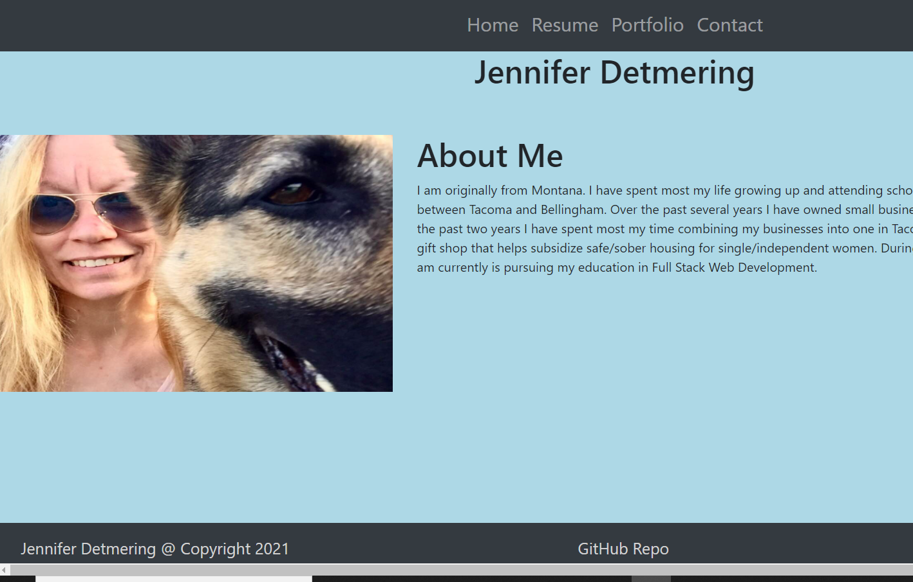

# Updated-Portfolio
by Jennifer Detmering

## Description

This is my updated responsive portfolio. My updated portfolio includes working links, my personal history and resume. My portfolio highlights three projects I am most proud of. I have changed the styling as well of my portfolio.

## Technologies Used
HTML, CSS, Bootstrap, JavaScript, Luxon

## Installation

<a href="https://kodiakshuksan.github.io/Responsive-Portfolio/">Portfolio Link</a>

## Usage and Picture of Portfolio

Use navigation bar to follow links to learn more about me personally and professionally. I included a link to my portfolio projects. Please use my contact link if you have any further questions or would like further information.

## Credits

<a href="https://w3schools.com">W3 Schools Link</a>

## License and HTML Validation

<a href="LICENSE.txt">License Document<a>

<a href="https://w3schools.com">HTML Validation</a>

